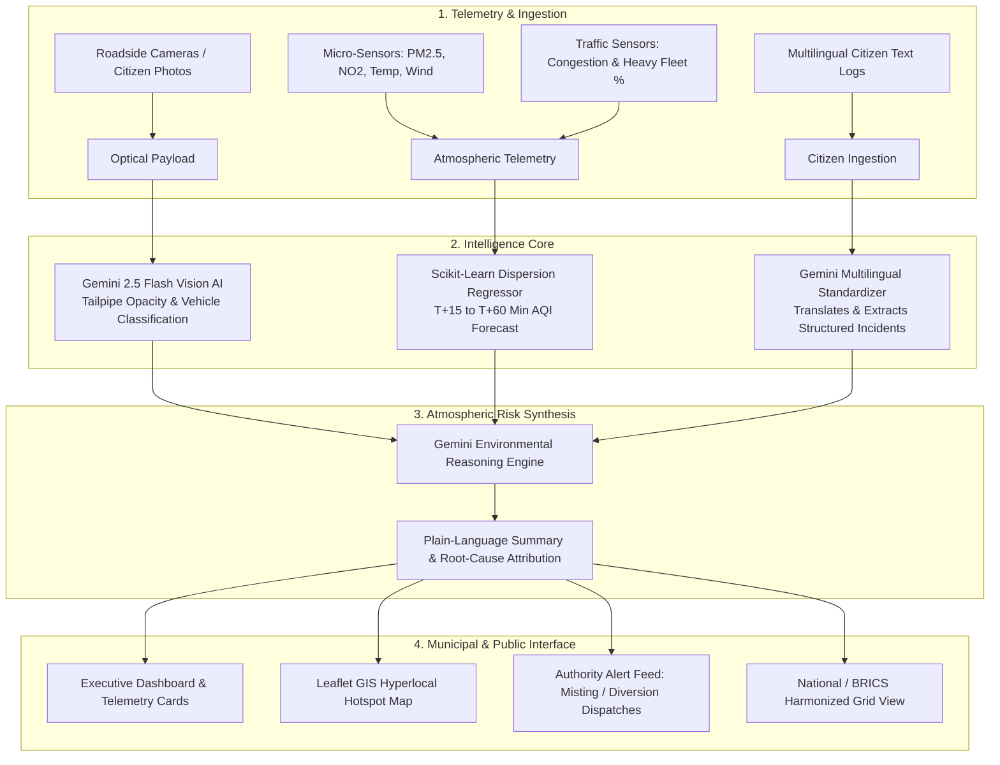
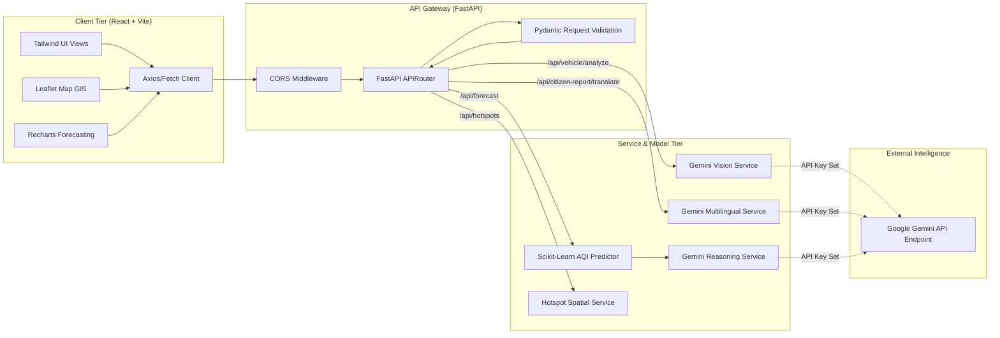

# NIRVĀYU 
> **AI-Powered Hyperlocal Emission & Air-Quality Intelligence Platform**

[](https://www.python.org/)
[](https://fastapi.tiangolo.com)
[](https://react.dev/)
[](https://tailwindcss.com/)
[](https://scikit-learn.org/)
[](https://ai.google.dev/)
[](https://leafletjs.com/)

---

## 1. Project Title and Tagline

* **Name:** **NIRVĀYU** (Derived from Sanskrit: *Nir* [Free from] + *Vāyu* [Air] — Pure Air Intelligence)
* **Tagline:** *Hyperlocal Vehicle-Emission Screening, Short-Term Atmospheric Forecasting, and Sovereign Climate Intelligence.*

---

## 2. The Problem

Urban centers in developing and industrializing economies face acute, volatile air quality degradation driven predominantly by vehicular exhaust, localized bottleneck congestion, and micro-climate stagnation. 

Key challenges include:
* **Micro-Level Blindspots:** Traditional macro-level ambient air-quality monitoring stations (CPCB / CAAQMS) are sparse (often 5–15 km apart), failing to capture acute street-level particulate micro-spikes.
* **Lagging Reaction Times:** Authorities typically react hours or days after severe smog forms rather than mitigating traffic and tailpipe spikes with 15–60 minute lead times.
* **Manual Tailpipe Audits:** Physical emissions compliance testing (e.g., PUC checks) cannot continuously screen thousands of commercial freight haulers, transit buses, and two/three-wheelers at scale.
* **Linguistic Barriers:** Ground-level citizen observations in regional languages (e.g., Hindi, Telugu, Portuguese, Mandarin) remain untranslated and disconnected from municipal dispatch grids.
* **Data Sovereignty & Cross-Border Silos:** Cities lack standardized, privacy-preserving frameworks to share atmospheric modeling insights across metropolitan boundaries and BRICS partner nations without centralizing proprietary raw sensor feeds.

---

## 3. The Solution

**NIRVĀYU** bridges the gap between macro-scale ambient monitoring and street-level environmental enforcement. It couples physics-grounded machine learning regressions with multimodal Large Language Model (LLM) vision and reasoning to provide real-time, actionable air quality intelligence.

```
+-----------------------------------------------------------------------------------+
|                                 NIRVĀYU PLATFORM                                  |
+-----------------------------------------------------------------------------------+
|  [ Optical Vision AI ]     [ Predictive Dispersion ML ]     [ Sovereign Grid ]   |
|  Tailpipe Smoke Screening     15 - 60 Min AQI Forecast         Cross-City Mesh    |
|             \                         |                         /                 |
|              \                        |                        /                  |
|               +------->  [ Gemini Reasoning Engine ]  <-------+                   |
|                                       |                                           |
|                                       v                                           |
|                  [ Dynamic Authority Action Dispatches ]                          |
+-----------------------------------------------------------------------------------+
```

---

## 4. Key Features

| Capability | What It Does | Implementation Status |
| :--- | :--- | :--- |
| **Multimodal Tailpipe Optical Screening** | Inspects roadside vehicle photos/camera frames to identify vehicle classes, detect visible exhaust plumes, estimate Ringelmann smoke opacity, and output an Emission Risk Index (0–100). | `[Implemented]` *(Gemini 2.5 Flash + Fallback)* |
| **Short-Term Predictive AQI Forecasting** | Forecasts quantitative AQI trajectories at **T+15m, T+30m, T+45m, and T+60m** based on baseline AQI, traffic congestion, wind vectors, ambient temperature, and heavy fleet ratios. | `[Implemented]` *(Scikit-Learn Multi-Output Model)* |
| **Atmospheric AI Reasoning** | Synthesizes telemetry inputs and ML predictions into plain-language environmental diagnosis, root-cause attribution, and municipal intervention protocols. | `[Implemented]` *(Gemini 2.5 Flash)* |
| **Hyperlocal Spatial Monitoring** | Interactive Leaflet GIS map with 12 street-level monitoring nodes across Hyderabad (e.g., Gachibowli, Charminar, Uppal, Jeedimetla, Kukatpally) displaying live AQI, traffic density, and sensor feeds. | `[Implemented]` *(Leaflet + React)* |
| **Intelligent Authority Alert Engine** | Generates prioritized municipal action dispatches categorized into `Pollution Spikes`, `Recurring Hotspots`, and `High-Risk Vehicle Clusters` with clear rationales. | `[Implemented]` |
| **Multilingual Citizen Reporting** | Enables ground reporting in **English, Hindi (हिन्दी), Telugu (తెలుగు), Portuguese (Português), and Mandarin (中文)** with automated translation and structured incident extraction. | `[Implemented]` *(Gemini Multilingual Engine)* |
| **BRICS Federated Telemetry Mesh** | Demonstrates cross-border / national data harmonization (Hyderabad, Bangalore, Delhi, Mumbai) under Open Climate Telemetry Schemas with simulated federated aggregation rounds. | `[Prototype Simulation]` |

---

## 5. End-to-End Workflow



---

## 6. Google Gemini Integration

NIRVĀYU leverages **Google Gemini 2.5 Flash** (via the official `google-genai` Python SDK) for three discrete, specialized responsibilities:

```
                  +----------------------------------------------+
                  |            Google Gemini 2.5 Flash           |
                  +----------------------------------------------+
                                  /       |       \
                                 /        |        \
    +---------------------------+         |         +-----------------------------+
    | 1. Optical Vision AI      |         |         | 3. Multilingual Standardizer|
    | - Tailpipe smoke detection|         |         | - Translates Hindi/Telugu/  |
    | - Vehicle class detection |         |         |   Portuguese/Mandarin       |
    | - Ringelmann opacity      |         |         | - Structured schema output  |
    +---------------------------+         |         +-----------------------------+
                                          v
                        +-----------------------------------+
                        | 2. Environmental Reasoning Engine |
                        | - Interprets ML forecast numbers  |
                        | - Identifies causal factors       |
                        | - Drafts municipal instructions   |
                        +-----------------------------------+
```

### Architectural Guardrail: Numerical Integrity
> [!IMPORTANT]
> **Gemini does NOT invent, recalculate, or alter numerical AQI forecast values.**
> Numerical AQI forecasting is computed strictly by the deterministic Scikit-Learn dispersion regression pipeline. Gemini is supplied the verified mathematical forecast and real-time sensor parameters to generate scientific explanations, causal attribution, and administrative advisories.

### Heuristic Fallback Architecture
If the `GEMINI_API_KEY` is omitted or network connectivity is interrupted, the backend seamlessly switches to internal **High-Fidelity Heuristic Engines** for visual screening, environmental reasoning, and multilingual standardization—ensuring uninterrupted offline evaluation.

---

## 7. Predictive Machine Learning Approach

Short-term atmospheric forecasts (15, 30, 45, and 60 minutes) are modeled as a multi-target regression problem governed by atmospheric boundary layer and vehicular emission dispersion physics.

### Model Formulation
$$\Delta \text{AQI}(t + \Delta t) = f\big(\text{AQI}_0, \rho_{\text{traffic}}, v_{\text{wind}}, T_{\text{ambient}}, r_{\text{heavy}}\big)$$

Where:
* $\text{AQI}_0$: Baseline localized Air Quality Index
* $\rho_{\text{traffic}} \in [0.0, 1.0]$: Normalized traffic congestion density index
* $v_{\text{wind}}$: Horizontal wind speed ($\text{km/h}$)
* $T_{\text{ambient}}$: Ambient dry-bulb temperature ($^\circ\text{C}$)
* $r_{\text{heavy}} \in [0.0, 1.0]$: Ratio of heavy commercial freight / diesel transit vehicles

### Physics-Informed Dynamics
* **Accumulation Term:** $\alpha \cdot \rho_{\text{traffic}} + \beta \cdot r_{\text{heavy}}$ drives particulate loading and NOx buildup from prolonged engine idling and diesel acceleration.
* **Dispersion / Ventilation Term:** $-\gamma \cdot v_{\text{wind}}$ models horizontal advection and dilution.
* **Thermal Inversion / Boundary Term:** Accounts for atmospheric stability trapping pollutants near ground level at elevated temperatures.

### Model Architecture
* **Algorithm:** Multi-Output `RandomForestRegressor` (`n_estimators=60`, `max_depth=8`, `random_state=42`) with standard feature scaling.
* **Prediction Horizons:** 15m, 30m, 45m, 60m with horizon-dependent confidence bands ($R^2 \approx 0.89$).

---

## 8. Hyperlocal Pollution Detection

NIRVĀYU maps street-level micro-climates across 12 high-priority monitoring nodes in the Hyderabad metropolitan area:

```
[Uppal Corridor (NH163)]          [Jeedimetla Industrial]          [Kukatpally Y-Junction]
      AQI: 224 (Critical)               AQI: 238 (Critical)               AQI: 196 (Severe)
      Source: Diesel Freight            Source: Chemical/Boiler           Source: Commercial Highway
                \                               |                               /
                 \                              |                              /
                  +------------->   [ NIRVĀYU GIS MAP ]   <-------------------+
                                 (Leaflet + Live Feeds)
```

| Node | Baseline AQI | Primary Risk Level | Dominant Micro-Source |
| :--- | :--- | :--- | :--- |
| **Gachibowli Junction** | 184 | Severe | ORR Feeder / Tech shuttle idling in underpass canyon |
| **Charminar Heritage Corridor** | 158 | Unhealthy | 2-stroke 3-wheelers & narrow street canyon entrapment |
| **HITEC City Cyber Towers** | 142 | Unhealthy | Fleet cabs and peak commuter stop-and-go congestion |
| **Begumpet Arterial Corridor** | 172 | Severe | Interstate bus corridor and diesel freight movement |
| **Uppal Industrial & NH163** | 224 | Critical | Inbound logistics trucks & low boundary layer stagnation |
| **Secunderabad Railway Hub** | 149 | Unhealthy | Diesel shunting locomotives & multi-modal passenger hub |
| **Kukatpally Y-Junction** | 196 | Severe | Commercial highway bottleneck & overloaded tipper trucks |
| **Panjagutta Crossroads** | 165 | Severe | Multi-tier flyover convergence & idling micro-pockets |
| **Jeedimetla Industrial Area** | 238 | Critical | Chemical logistics tankers & industrial boiler fuel burn |
| **LB Nagar Ring Road** | 178 | Severe | Interstate freight convergence & nocturnal truck entry |
| **KBR Park Ecological Buffer** | 62 | Good | Dense botanical tree canopy & low passenger density |
| **Mehdipatnam Bus Terminal** | 160 | Severe | Suburban commuter buses beneath elevated expressway |

---

## 9. BRICS & National Sovereign Grid Architecture

To support cross-border collaboration without compromising national data sovereignty, NIRVĀYU implements the **Open Climate Telemetry Schema (OCTS v1.0)**.

```
+---------------------------------------------------------------------------------+
|                       FEDERATED AIR-QUALITY PARAMETER MESH                      |
+---------------------------------------------------------------------------------+
          |                                                       |
          v                                                       v
[ Hyderabad Node (Active) ]                            [ Delhi NCR Node (Syncing) ]
  • Lat/Lng: 17.385, 78.486                              • Lat/Lng: 28.704, 77.102
  • 28 Micro-Sensors (142.8 GB)                          • 64 Micro-Sensors (385.2 GB)
  • Primary: PM2.5 / NOx                                 • Primary: PM2.5 / Heavy Soot
  • Local Model: FedAvg Round 48                         • Local Model: Aggregating Round 49
          |                                                       |
          +------------------------+     +------------------------+
                                   |     |
                                   v     v
                         [ Parameter Aggregator ]
                      • Differential Privacy Budget: ε=0.5
                      • Consensus Loss: 0.038
                      • Raw Data Never Leaves Node
```

* **Data Sovereignty:** High-resolution sensor records and license plate metadata remain strictly on local edge nodes; only model parameter weights ($\Delta W$) and standardized summary indices are shared.
* **Cross-City Synchronization:** Connects nodes across Hyderabad, Bengaluru, Delhi, and Mumbai to evaluate regional trans-boundary pollution drift.

---

## 10. Multilingual Citizen Reporting

Citizens can upload photos and report high-emission incidents using their native languages. The Gemini-powered translation engine automatically converts free-text reports into structured schema items.

### Supported Language Examples
* **English:** *"Heavy black smoke pouring from commercial tipper truck near junction."*
* **Hindi (हिन्दी):** *"चौराहे पर खड़े ट्रक से बहुत घना काला धुआं निकल रहा है।"*
* **Telugu (తెలుగు):** *"టోలిచౌకి ఫ్లైఓవర్ వద్ద లారీ నుండి భారీ నల్లటి పొగ వస్తోంది."*
* **Portuguese (Português):** *"Caminhão soltando fumaça preta muito densa no cruzamento."*
* **Mandarin (中文):** *"在十字路口看到大型卡车排放大量浓黑烟。"*

### Standardized Schema Output
```json
{
  "incident_type": "Dense Acceleration Smoke Plume",
  "vehicle_type": "Heavy Commercial Tipper Truck",
  "severity": "Critical",
  "description_english": "Observed heavy commercial tipper truck producing dense black exhaust smoke while idling near junction bottleneck."
}
```

---

## 11. Technology Stack

```
Frontend (SPA)                Backend (REST API)             AI / ML Layer
+------------------------+    +-------------------------+    +--------------------------+
| React 19               |    | FastAPI (Python 3.10+)  |    | Google Gemini 2.5 Flash  |
| Vite 8                 |    | Uvicorn ASGI Server     |    | (google-genai SDK)       |
| TailwindCSS v4         |    | Pydantic v2 Models      |    |                          |
| Leaflet 1.9.4          |    | Python-Dotenv           |    | Scikit-Learn 1.6+        |
| Recharts 3.10          |    | Python-Multipart        |    | (Random Forest Pipeline) |
| Lucide React Icons     |    +-------------------------+    |                          |
| TypeScript 6.0         |                                   | NumPy Data Arrays        |
+------------------------+                                   +--------------------------+
```

---

## 12. System Architecture



---

## 13. Dataset Sources

NIRVĀYU's physics parameters and baseline values are calibrated against standard environmental and traffic benchmarks:
1. **Atmospheric Dispersion Physics:** Calibrated against Gaussian Plume dispersion equations and micro-climate thermal stability models.
2. **Central Pollution Control Board (CPCB) India Standards:** National Air Quality Index (NAQI) breakpoints (Good: 0–50, Moderate: 51–100, Unhealthy: 101–200, Severe: 201–300, Critical: 301–500).
3. **Smoke Opacity Classifications:** Standardized using the international **Ringelmann Smoke Chart** (Classes 0 to 5).
4. **Urban Traffic Congestion Metrics:** Calibrated against TomTom and OpenStreetMap metropolitan speed-reduction indices.

---

## 14. Prototype & Sample Data Disclosure

> [!NOTE]
> ### Transparent System Disclosure
> * **Spatial Hotspots (12 nodes):** Geographically accurate coordinates in Hyderabad initialized with representative telemetry to demonstrate real-time map visualization and filter capabilities.
> * **BRICS Network Grid:** Demonstrates cross-city federated data structures and parameter exchange schemas using simulated nodes for Bangalore, Delhi, and Mumbai alongside Hyderabad.
> * **In-Memory Citizen Ledger:** The prototype stores newly submitted citizen reports in an active in-memory ledger during the runtime session.
> * **ML Training:** The predictive Scikit-Learn regressor is initialized and fitted upon backend startup using environmental dispersion parameters.

---

## 15. Local Setup Instructions

### Prerequisites
* **Node.js** (v18.0.0 or higher) & **npm**
* **Python** (v3.10, 3.11, or 3.12)
* **Git**

---

### Step 1: Clone the Repository
```bash
git clone https://github.com/SK-Sathyavada-008/nirvayu.git
cd nirvayu
```

---

### Step 2: Backend Setup
```bash
# Navigate to backend directory
cd backend

# Create a virtual environment
python -m venv venv

# Activate virtual environment
# On Windows (PowerShell):
.\venv\Scripts\Activate.ps1
# On Linux/macOS:
source venv/bin/activate

# Install dependencies
pip install -r requirements.txt

# Configure environment variables (Optional, falls back gracefully)
cp .env.example .env

# Run FastAPI backend server
uvicorn app.main:app --host 127.0.0.1 --port 8000 --reload
```
*Backend API Documentation is available at:* `http://127.0.0.1:8000/docs`

---

### Step 3: Frontend Setup
Open a new terminal window:
```bash
# Navigate to frontend directory
cd frontend

# Install Node packages
npm install

# Start Vite development server
npm run dev
```
*Frontend Application will be running at:* `http://localhost:5173`

---

### Step 4: Run Automated Verification Tests
To verify all backend endpoints and ML pipelines:
```bash
cd backend
python test_endpoints.py
```

---

## 16. Environment Variables

Create a `backend/.env` file with the following keys:

```env
# Google Gemini API Key (Get from https://aistudio.google.com/)
# If left blank, NIRVĀYU runs seamlessly using High-Fidelity Heuristic Fallbacks.
GEMINI_API_KEY=your_gemini_api_key_here
```

---

## 17. API Endpoints

| Method | Endpoint | Description | Request Payload / Query Params |
| :--- | :--- | :--- | :--- |
| `GET` | `/` | Root health check & endpoint index | None |
| `POST` | `/api/vehicle/analyze` | Multimodal tailpipe smoke analysis | `multipart/form-data` (`file`: image) |
| `GET` | `/api/forecast` | Scikit-Learn ML forecast + Gemini reasoning | `?city=Hyderabad&current_aqi=164&traffic_density=0.85&wind_speed=5.2&temperature=31.5&heavy_vehicle_ratio=0.38` |
| `GET` | `/api/hotspots` | Spatial monitoring nodes | `?city=Hyderabad&min_aqi=150&severity=Severe` |
| `GET` | `/api/alerts` | Authority action dispatches | `?city=Hyderabad&category=all&severity=Critical` |
| `GET` | `/api/citizen-report` | Retrieve crowdsourced reports | None |
| `POST` | `/api/citizen-report` | Submit citizen report + AI verification | `JSON` (`location`, `description`, `severity`, `vehicle_type`, `image_url`) |
| `POST` | `/api/citizen-report/translate` | Multilingual text translation & standardization | `JSON` (`text`: string, `language`: "auto") |
| `GET` | `/api/brics` | Harmonized cross-border grid telemetry | None |

---

## 18. Deployment Instructions

### Containerized Deployment (Docker)

#### Backend `Dockerfile`
```dockerfile
FROM python:3.11-slim
WORKDIR /app
COPY requirements.txt .
RUN pip install --no-cache-dir -r requirements.txt
COPY . .
EXPOSE 8000
CMD ["uvicorn", "app.main:app", "--host", "0.0.0.0", "--port", "8000"]
```

#### Frontend `Dockerfile`
```dockerfile
FROM node:20-alpine AS build
WORKDIR /app
COPY package*.json ./
RUN npm install
COPY . .
RUN npm run build

FROM nginx:alpine
COPY --from=build /app/dist /usr/share/nginx/html
EXPOSE 80
CMD ["nginx", "-g", "daemon off;"]
```

#### Production Orchestration (`docker-compose.yml`)
```yaml
version: '3.8'
services:
  backend:
    build: ./backend
    ports:
      - "8000:8000"
    environment:
      - GEMINI_API_KEY=${GEMINI_API_KEY}
    restart: unless-stopped

  frontend:
    build: ./frontend
    ports:
      - "80:80"
    depends_on:
      - backend
    restart: unless-stopped
```

---

## 19. Limitations

1. **Optical Screening vs. Chemical Analyzers:** Visual tailpipe analysis evaluates visible smoke opacity (particulate matter and unburnt fuel). It cannot directly measure invisible gases (e.g., carbon monoxide or low-concentration sulfur dioxide) without physical electrochemical probe integration.
2. **Camera Angles and Lighting:** Direct solar glare, heavy nighttime darkness, or obscured tailpipes can impact vision screening confidence scores.
3. **Simulated Federated Mesh:** The cross-border BRICS network in this version demonstrates data exchange schemas and consensus losses through simulated client nodes rather than live multi-country server clusters.
4. **Transient Storage:** In this prototype build, citizen reports are stored in backend application memory rather than a persistent distributed database cluster.

---

## 20. Future Roadmap

- [ ] **Production Database Persistence:** Transition in-memory stores to PostgreSQL with PostGIS extension for advanced geospatial queries.
- [ ] **Hardware Edge Deployment:** Package optical models into lightweight TensorRT / ONNX runtimes for deployment on roadside Raspberry Pi 5 / NVIDIA Jetson camera units.
- [ ] **Automated License Plate Recognition (ALPR):** Link optical high-emission flags with regional transport databases (e.g., VAHAN) to automate compliance verification notices.
- [ ] **Live Federated Learning Mesh:** Deploy decentralized Flower (`flwr`) or PySyft nodes across international municipal partners for true federated parameter aggregation.
- [ ] **Satellite Telemetry Ingestion:** Integrate Sentinel-5P and INSAT-3D aerosol optical depth (AOD) feeds to enhance macro-level boundary conditions.

---

## License
This project is licensed under the MIT License — see the [LICENSE](LICENSE) file for details.

## Author & Acknowledgements
* **Developed by:** NIRVĀYU Engineering Team
* Built with Google Gemini, FastAPI, React, and Scikit-Learn.
